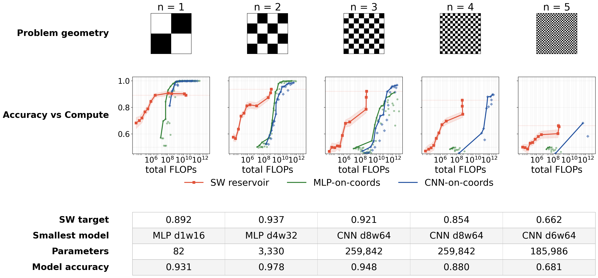

# Spin-wave reservoir vs. MLP / CNN on the XOR-chequerboard task ladder

Code and data to reproduce **Supplementary Fig. 7**: a comparison of the
spin-wave reservoir against MLP and CNN baselines on an XOR-chequerboard task
ladder, with the accompanying wavelength-matching and representation-lift
analyses.

**Target figure:** `figures/figS7_xor_ladder_comparison.png`



The figure compares three classifiers on a ladder of XOR-chequerboard
classification tasks at increasing spatial frequency (`n = 1 … 5`, i.e.
chequerboard period `P = 16, 8, 4, 2, 1` pixels on a 32×32 grid):

| Curve | What it is |
|-------|-----------|
| **SW reservoir** (red) | a micromagnetic spin-wave-disk reservoir read out by a top-`K` mutual-information feature `LinearSVC` with a sign-thresholded (binary) readout |
| **MLP-on-coords** (green) | a feed-forward multilayer perceptron trained on the raw `(x, y)` pixel coordinates |
| **CNN-on-coords** (blue) | a 2-D convolutional network on the same coordinate map, preserving spatial layout |

Each panel plots **balanced accuracy vs. total FLOPs**; the bottom table lists,
per rung, the SW-reservoir target accuracy and the smallest-parameter
feed-forward model that matches or beats it. The scientific result is that the
spin-wave substrate performs a nonlinear feature lift that solves fine-scale
parity where the feed-forward baselines fail at any compute budget in the swept
grids.

This folder is the self-contained code-plus-data package for the comparison
figure; the full method derivation is in the manuscript's supplement.

---

## 1. Quick start — regenerate the figure (no external data, seconds)

```bash
# from this folder, with the environment in §4 installed
python make_xor_comparison_figure.py
# -> figures/figS7_xor_ladder_comparison.png
```

This reads only the small result files bundled in `data/` and re-renders the
figure (Python 3.13, versions in §4).

---

## 2. Directory contents

```
xor_chequerboard/
├── README.md                       # this file
├── make_dataset.py                 # [stage 0] build the XOR-chequerboard datasets
├── build_xor_pixel_mi.py           # [stage 1a] per-(pixel,frame) MI of the substrate (SWR feature ranking)
├── top_k_svm_sweep.py              # [stage 1b] SW-reservoir top-K LinearSVC readout sweep
├── run_mlp_sweep_xor.py            # [stage 2a] MLP-on-coords 48-arch sweep
├── run_cnn_sweep_xor.py            # [stage 2b] CNN-on-coords 25-arch sweep
├── run_ext_sweep_xor.py            # [stage 2c] extended (bigger d,w) MLP/CNN gap-fill archs
├── analyse_xor.py                  # [stage 3] aggregate results into CSV/JSON tables
├── make_xor_comparison_figure.py   # [stage 4] render the comparison figure
├── run_sw_reservoir_sweep.sh       # orchestration: the launcher for stages 1a+1b (5 drives)
├── data/                           # bundled small results (2.5 MB; see §5)
└── figures/
    └── figS7_xor_ladder_comparison.png
```

---

## 3. Reproduction tiers

The pipeline has one external dependency — the raw micromagnetic substrate
response cubes (§6). Everything else regenerates from what is bundled here.

**Tier 0 — figure only (bundled data, ~2 s).** `python make_xor_comparison_figure.py` (see §1).

**Tier 1 — feed-forward baselines from scratch (bundled data, no GPU/substrate).**
The MLP and CNN consume only `data/xor_datasets.npz`, so they reproduce fully
from this package:

```bash
python make_dataset.py            # writes data/xor_datasets.npz (already bundled)
python run_mlp_sweep_xor.py       # -> data/mlp_sweep_xor.npz   (~3.5 h, 4-core CPU)
python run_cnn_sweep_xor.py       # -> data/cnn_sweep_xor.npz   (~1.8 h, 4-core CPU)
python run_ext_sweep_xor.py       # -> data/mlp_ext_xor.npz, data/cnn_ext_xor.npz
python analyse_xor.py             # -> data/*.csv, data/analyse_summary.json
python make_xor_comparison_figure.py
```

**Tier 2 — SW-reservoir results from raw substrate (needs the cubes in §6).**
The SWR pipeline additionally needs the substrate `m_z` cubes:

```bash
# per drive at 16×16 (via the bundled launcher):
bash run_sw_reservoir_sweep.sh
# the 32×32 cell used by the figure (run separately):
python build_xor_pixel_mi.py --cube <NLT4G32/t05/nlt4g32t05_mz_cube.npy> \
       --grid 32 --drive 45mT_t05 --xor_ds data/xor_datasets.npz --out_dir data
python top_k_svm_sweep.py --cube <...nlt4g32t05_mz_cube.npy> \
       --mi_cube data/pixel_mi_xor_cube_32_45mT_t05.npy \
       --xor_ds data/xor_datasets.npz --grid 32 --drive 45mT_t05 \
       --out data/topk_svm_32_45mT_t05.npz
```

---

## 4. Environment

Pure standard scientific-Python stack — **no project-local modules are imported**,
so the package is portable. Verified-working versions:

| Package | Version |
|---------|---------|
| python | 3.13.13 |
| numpy | 2.4.2 |
| scipy | 1.17.1 |
| scikit-learn | 1.8.0 |
| torch | 2.11.0 (CPU build) |
| matplotlib | 3.10.8 |
| Pillow | 12.1.1 |

```bash
pip install "numpy>=2.0" scipy scikit-learn torch matplotlib pillow
```

`torch` is needed only for the MLP/CNN sweeps (CPU is sufficient; the published
runs were CPU). The figure and the SVM pipeline need only numpy + scikit-learn +
matplotlib. These deps are also pinned in the top-level
`requirements.txt`.

> **No shared library needed.** Every script here imports only the standard
> scientific-Python stack above — no repo-root or project-local modules are
> required. This subfolder is fully standalone.

---

## 5. Bundled data files (`data/`, ~2.5 MB)

All are small results produced by the scripts above; the figure (Tier 0) loads
the five marked **[fig]**.

| File | Produced by | Contents |
|------|-------------|----------|
| `xor_datasets.npz` | `make_dataset.py` | XOR-chequerboard labels + `(x,y)` coord grids, 16×16 and 32×32, all scales |
| `topk_svm_16_{drive}.npz` ×5 | `top_k_svm_sweep.py` | SWR LinearSVC bal_acc vs `K` × readout × fold, 16×16, one per drive |
| `topk_svm_32_45mT_t05.npz` **[fig]** | `top_k_svm_sweep.py` | same, 32×32 (45 mT/800 MHz, t-step 0.5) — the figure's SW curve |
| `pixel_mi_xor_summary_{grid}_{drive}.npz` ×6 | `build_xor_pixel_mi.py` | per-scale max-over-time MI maps + scalars (summary of the large cube) |
| `mlp_sweep_xor.npz` **[fig]** | `run_mlp_sweep_xor.py` | 48-arch MLP bal_acc, FLOPs, params, per task/fold |
| `cnn_sweep_xor.npz` **[fig]** | `run_cnn_sweep_xor.py` | 25-arch CNN bal_acc, per-pixel/per-image FLOPs, params |
| `mlp_ext_xor.npz` **[fig]** | `run_ext_sweep_xor.py` | extended MLP archs for 32×32 P∈{1,2,4} |
| `cnn_ext_xor.npz` **[fig]** | `run_ext_sweep_xor.py` | extended CNN archs (incl. the `d8w64` entries in the figure table) |
| `*.csv`, `analyse_summary.json` | `analyse_xor.py` | aggregated summary tables (winner matrix, wavelength match, smallest-matching model) |

**Key array schemas** (open with `np.load(path, allow_pickle=True)`):

- *SWR* `topk_svm_*.npz`: `bal_acc` shape `(scale, K, readout, fold)`;
  `flops_fit`, `flops_predict_sample`, `n_test`; axes labelled by `scales`,
  `K_list`, `readouts` (`['analog','binary','ternary']`).
- *MLP* `mlp_sweep_xor.npz`: `mean_final` shape `(task, depth, width)`;
  `depths`, `widths`, `task_grid`, `task_P`, `params`, `fwd_flops`,
  `n_train_per_task`, `epochs`.
- *CNN* `cnn_sweep_xor.npz`: `mean_final` shape `(task, depth, width)`;
  `fwd_flops_per_pixel`, `fwd_flops_img_per_task`, plus the MLP-shared keys.

---

## 6. External data dependency — substrate `m_z` cubes (NOT bundled)

The SW-reservoir features come from micromagnetic (mumax³) simulations of a
spin-wave disk. Each cube is an array of shape `(N_pixels, T, H, W)` =
`(grid², 201, 50, 50)` float32 (≈ 1 GB each) holding the out-of-plane
magnetisation `m_z(t)` of the disk for every coordinate-encoded input. They are
**inputs** to `build_xor_pixel_mi.py` and `top_k_svm_sweep.py` only.

| Cube | Drive | Grid | Used for |
|------|-------|------|----------|
| `nlt4_mz_cube.npy` | 45 mT / 800 MHz | 16×16 | 16×16 SWR sweep |
| `nlt4_15mT200_mz_cube.npy` | 15 mT / 200 MHz | 16×16 | wavelength-match sweep |
| `nlt4_15mT1100_mz_cube.npy` | 15 mT / 1100 MHz | 16×16 | wavelength-match sweep |
| `nlt4_30mT500_mz_cube.npy` | 30 mT / 500 MHz | 16×16 | wavelength-match sweep |
| `nlt4_60mT_mz_cube.npy` | 60 mT / 1100 MHz | 16×16 | wavelength-match sweep |
| `nlt4g32t05_mz_cube.npy` | 45 mT / 800 MHz | 32×32 | **the figure's SW curve** |

**Generation code is included.** The micromagnetic (mumax³) code that produced
these cubes lives at the top of the repo in [`../../simulator/`](../../simulator/) — the
production multi-GPU sweep driver (`run_sweep.py`), the standalone `.mx3`
sources, and the CSV→cube assembler (`build_cube.py`), with full physical
parameters and a regeneration recipe in [`../../simulator/README.md`](../../simulator/README.md).

**Requesting the raw cubes.** The cubes themselves are too large to archive with
the code and are available on request from the corresponding author
(safeer.chenattukuzhiyil@physics.ox.ac.uk). Each cube is float32
`(N_samples, T, H, W)`; the figure's cube `nlt4g32t05_mz_cube.npy` is
`(1024, 201, 64, 64)`. Once obtained, pass its path to the scripts via the
`--cube` CLI argument (see §3, Tier 2). If you only need to reproduce the
figure or the MLP/CNN results, the bundled `.npz` caches are sufficient and
the cubes are not required.

Provenance: the 32×32 cube was generated by the matched-window
[`../../simulator/run_sweep.py`](../../simulator/run_sweep.py); the 16×16 drive
cubes (wavelength panels, identical geometry) by the same simulator at the
coarser drive-step setting. The same spin-wave-disk substrate is analysed in
the sibling package [`../kernel_rank_cg/`](../kernel_rank_cg/). Once the figure's
result file `data/topk_svm_32_45mT_t05.npz` exists (bundled here), the figure
reproduces without the cubes.

---

## 7. Method summary (as run)

- **Task.** XOR chequerboard: `label(i,j;P) = ((⌊i/P⌋ + ⌊j/P⌋) mod 2)`; exact
  50/50 class balance. Grids 16×16 (P∈{1,2,4,8}) and 32×32 (P∈{1,2,4,8,16}).
- **SW reservoir readout.** Rank substrate `(pixel,frame)` cells by mutual
  information `I(m_z; Y_XOR(P))` (5-bin equal-frequency estimator, Miller–Madow
  bias correction); take the top `K ∈ {32…2048}`; fit `LinearSVC`
  (squared-hinge, L2, `C=1.0`) inside a `StandardScaler` → optional sign /
  ternary thresholding pipeline. The figure uses the **binary** readout.
- **MLP-on-coords.** 48 archs (depth ∈ {1,2,3,4,6,8} × width ∈
  {2,4,8,16,32,64,128,256}), 400 epochs Adam (lr 1e-3) + cosine, input = `(x,y)`.
- **CNN-on-coords.** 25 archs (depth ∈ {1,2,3,4,6} × channels ∈ {4,8,16,32,64}),
  3×3 kernels `padding=same`, per-pixel 2-class logit map, cross-entropy masked
  to training-fold pixels; extended grid adds larger depth/width.
- **Cross-validation.** `RepeatedStratifiedKFold(n_splits=5, n_repeats=3,
  random_state=0)` — identical 15 partitions across all three classifiers, so
  FLOPs-vs-accuracy comparisons are apples-to-apples.
- **FLOPs.** SVM inference `2K`/sample; MLP/CNN forward and training FLOPs from
  the per-arch parameter counts (see `analyse_xor.py` and the report).

